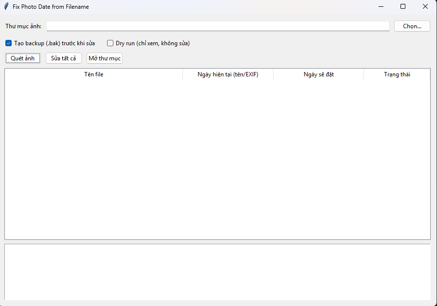
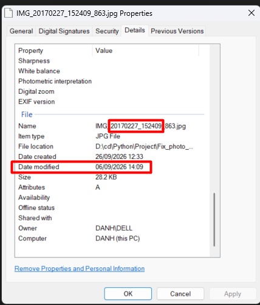
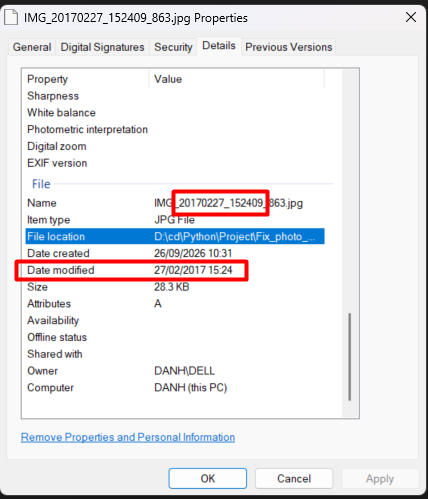

### Interface



### Demo
Filename mentions timestamp of 2017, but modified time is 2026

BEFORE:



AFTER:



### Usage Guide

1. Start the application and click **Chọn...** (Select) to choose the folder containing the photos. Selecting a folder automatically scans it.
2. Alternatively, enter or select a folder and click **Quét ảnh** (Scan Photos) to refresh the file list.
3. Review the list. JPG/JPEG files with a recognized timestamp show **Sẵn sàng** (Ready) and the date that will be applied. Other files show **Không nhận dạng** (Not recognized) and are not included in the update.
4. Keep **Tạo backup (.bak) trước khi sửa** (Create backup before editing) enabled to save a copy of each photo before it is changed. The backup is created next to the original file.
5. Enable **Dry run (chỉ xem, không sửa)** (Preview only, do not edit) to confirm how many recognized photos would be updated without changing them.
6. When ready to make changes, turn Dry run off and click **Sửa tất cả** (Fix All). Review the confirmation dialog and continue to update the photos.
7. Check the activity log for successful updates or errors. Click **Mở thư mục** (Open Folder) to open the selected folder in the file manager.

The tool currently supports JPEG files with timestamps in either of these filename formats:

```text
YYYYMMDD_HHMMSS
YYYYMMDD-HHMMSS
```

For example, `IMG_UPLOAD_20230422_103446.jpg` sets the photo date to `2023-04-22 10:34:46`. The date is written to the common EXIF date fields and the file's access and modified timestamps.